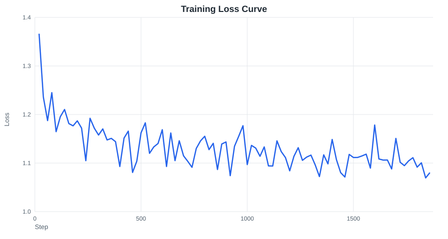

# Finance SFT Qwen

基于 Qwen3-4B-Instruct 的中文金融问答 SFT 微调与量化评测项目。

## 项目目标

- 使用 QLoRA 对 Qwen3-4B-Instruct 做金融问答 SFT 微调。
- 在 2000 条未见过的金融评测问题上对比 base 与 SFT 的生成质量。
- 产出可复现的数据准备、训练、评测、推理代码。

## 技术栈

- Python / PyTorch / Hugging Face Transformers
- PEFT QLoRA（4-bit NF4）
- 数据：BAAI/IndustryInstruction_Finance-Economics 中文子集

## 数据

- 原始数据 122,090 条
- 中文子集 40,135 条
- 去重后 40,131 条
- 质量过滤后 39,677 条
- train / dev / eval = 30,000 / 2,000 / 2,000

## 训练

- 模型：Qwen/Qwen3-4B-Instruct-2507
- 方法：QLoRA，rank=16，alpha=32，dropout=0.05
- 优化：warmup + cosine 学习率，有效 batch size 16
- 训练：30,000 条，1 epoch，约 1,875 步
- 最终训练 loss：约 1.08



## 评测结果

在 2,000 条金融问答评测集上，base vs SFT：

| metric | base | SFT | delta |
| --- | ---: | ---: | ---: |
| ROUGE-L F1 | 0.1912 | 0.3627 | +0.1715 |
| BLEU | 0.0992 | 0.2948 | +0.1956 |
| ROUGE-L Precision | 0.1349 | 0.3775 | +0.2426 |
| ROUGE-L Recall | 0.3782 | 0.3756 | -0.0026 |
| Mean Prediction Length | 886.3 | 276.8 | -609.5 |

SFT 后答案更精炼、与参考答案重叠度更高：ROUGE-L F1 从 0.191 提升至 0.363，BLEU 从 0.099 提升至 0.295，平均生成长度从 886 字符降至 277 字符。

## 运行方式

数据准备：

```bash
python scripts/prepare_data.py
```

训练：

```bash
python scripts/train_sft.py --config configs/train_sft.yaml
```

评测（单卡）：

```bash
python scripts/evaluate.py --config configs/eval.yaml
```

评测（四卡）：

```bash
CUDA_VISIBLE_DEVICES=0 python scripts/evaluate.py --config configs/eval.yaml --worker-index 0 --num-workers 4 &
CUDA_VISIBLE_DEVICES=1 python scripts/evaluate.py --config configs/eval.yaml --worker-index 1 --num-workers 4 &
CUDA_VISIBLE_DEVICES=2 python scripts/evaluate.py --config configs/eval.yaml --worker-index 2 --num-workers 4 &
CUDA_VISIBLE_DEVICES=3 python scripts/evaluate.py --config configs/eval.yaml --worker-index 3 --num-workers 4 &
```

合并四卡评测结果：

```bash
python scripts/merge_predictions.py --num-workers 4
```

交互预测（SFT 模型）：

```bash
python scripts/predict.py --adapter outputs/checkpoints/final
```

## Web 部署

启动 FastAPI 服务：

```bash
python scripts/app.py --port 8001
```

服务启动后，通过 SSH 隧道映射到本地：

```bash
ssh -p 你的实例端口 -L 8001:127.0.0.1:8001 root@你的实例地址
```

浏览器访问：

```text
http://127.0.0.1:8001
```

网页内可直接与微调后的模型对话。服务采用懒加载，第一次提问时才加载模型。
